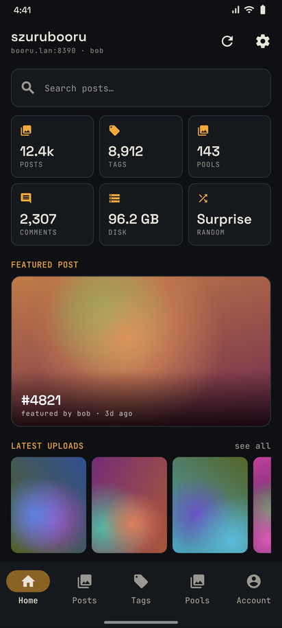
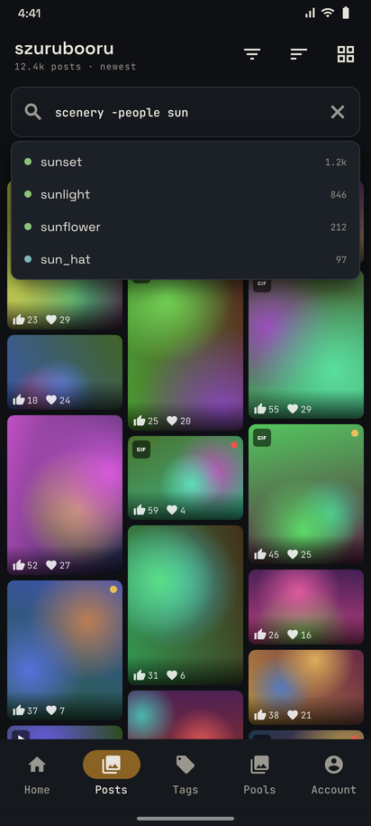
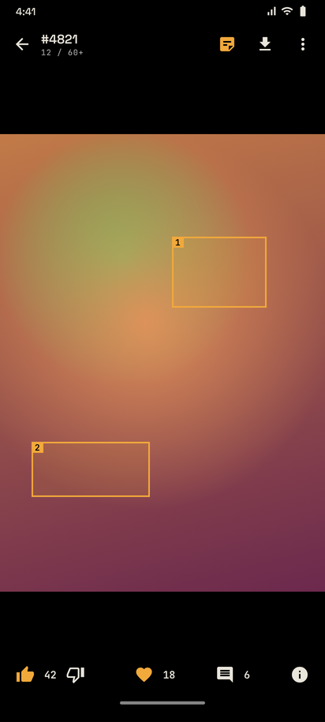
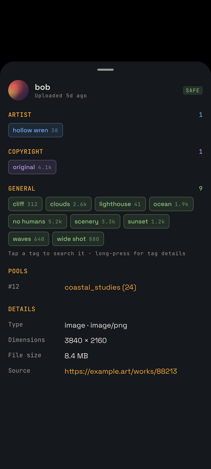

<div align="center">



*Your Szurubooru in your pocket... browse, upload, tag, and tidy it all from one Android app.*

</div>

---

## Screenshots

<div align="center">

| | |
|:-:|:-:|
|  |  |
|  |  |

</div>

---

## What it does

ProtoBooru is a native Android client for a self-hosted [Szurubooru](https://github.com/rr-/szurubooru).
It talks straight to the Szurubooru REST API, so there's nothing extra to run on your server. It covers
browsing, posting, editing, and admin: everything the web UI does, in one app made for a phone.
It works over plain HTTP, so a Tailscale address is all you need.

## Features

| | |
|---|---|
| 🏠 **Custom Home** | Keep the default Home or build your own from 12 widgets: search, stats tiles, featured post, post rows and grids from any query, a re-rollable random post, top tags, pools, recent comments, shortcuts, saved searches, and section titles. Reorder, hide, duplicate, and fine-tune each one (counts, sizes, columns, queries with `{me}`), then copy a layout to another device. |
| 🔍 **Search** | Full Szurubooru query syntax with live tag autocomplete (handles `-negation` too), 12 sort presets, quick filters (my favorites, my uploads, liked, tumbleweeds, notes…), safety toggles, and a search history. |
| 🚫 **Tag blacklist** | Posts with blacklisted tags (wildcards allowed) are left out of every search and Home widget. Posts reached any other way open covered, with a “Show anyway” button. |
| 🖼️ **Grid** | Staggered or square, 1–6 columns, infinite scroll and pull to refresh. Badges show video, GIF, safety, score, and favorites. Long-press to multi-select. |
| 👆 **Viewer** | Swipe through the whole result list. Pinch and double-tap zoom, GIFs, and videos with their own seek bar. **Swipe up** for post details. |
| 🎬 **Fullscreen video** | True immersive fullscreen that rotates to fit the video. Double-tap left to skip back 5s or right to skip ahead 15s, and keep tapping to keep skipping. Swipe up or down on the left for brightness, on the right for volume. Mute, rotate, and exit buttons. |
| 📝 **Notes** | Note outlines on the image, with their text fitted neatly inside each box: always shown, shown on tap, or outlines only. Notes too small for their text open as a bubble beside the box. |
| 🏷️ **Post details** | Tags grouped and colored by category (tap to search, long-press for the tag page), pools, related posts, notes, file info, sources, checksums, and who favorited it. |
| ⬆️ **Upload** | From the gallery, files, or a URL; the server fetches URLs with yt-dlp for video sites. Shared tags, safety, and source per batch with per-item overrides. Skips exact duplicates and can link a batch as related posts. |
| 📤 **Share to ProtoBooru** | Share images, videos, or links from any app with **Upload to ProtoBooru**, or reverse-search an image with **Search ProtoBooru**. |
| ✏️ **Edit posts** | Tags, safety, source, relations, pools, flags, and note text. Replace the file, set a custom thumbnail, feature the post, merge it into another post, or delete it. **Copy tags** from one post and paste them onto another, or pull them straight from a post number. |
| 🧰 **Bulk edit** | Add or remove tags, set safety or source, link as related, add to a pool, or delete, across any selection. Runs one post at a time to avoid database deadlocks. |
| 📚 **Tags & pools** | Create, rename, add aliases, implications, and suggestions, merge, and delete. Reorder pool posts and add them by ID range (`20-24`). Manage tag and pool categories with colors and a default. |
| 💬 **Comments** | A site-wide feed and per-post threads. Vote on comments, and edit or delete your own (or anyone's, with permission). |
| 👥 **Users** | Profiles with uploads, favorites, and comments. Admins can change ranks or delete users. Upload an avatar or use Gravatar. |
| 🔑 **Account** | Signing in with a password creates a per-device login token, so the password is never stored. You can also paste an existing token. Manage every token: create with an expiry, disable, rename, delete. |
| 📜 **History** | The site's snapshot log with type filters and readable JSON diffs. |
| 🔎 **Image search** | Reverse-search your booru with any picture, or find posts similar to the one you're viewing. |
| 💾 **Downloads** | Single or batch downloads to `Pictures/ProtoBooru` and `Movies/ProtoBooru`, with a filename pattern. Files already downloaded are skipped. |
| 📴 **Offline** | Save searches and pools (optionally with videos) to the phone. When the server can't be reached, or you switch on **Offline mode**, the app shows only what's saved, loads it from storage, and switches back by itself when the server returns. |
| ⬇️ **In-app updates** | Checks GitHub Releases on launch and every 6 hours, can notify you, and downloads and installs new builds in place. Choose the **Stable** channel (tagged releases) or **Nightly** (every push). |
| ⚙️ **Settings** | Searchable settings with a live connection card and one page per topic. Every row shows what's set, sliders preview the grid as you drag, and a long-press resets any setting. Storage shows what's using space and lists everything saved for offline, with refresh, remove and an optional daily refresh. |
| 🎨 **Themes** | Dark ink theme with 12 accent colors and a pure-black AMOLED mode. |
| 🔒 **Privacy & security** | Optional app lock with a passcode (salted hash, growing wait after wrong tries) or Android's biometric prompt, asked whenever the app opens or comes back, with a lock-after delay. Hide the app's preview in recent apps and block screenshots. |
| 🛡️ **Permissions** | Every action shows up only if your rank has it on the server, read from its privilege config. |

---

## Install

Grab the APK from the latest [Release](../../releases) or from the newest **Build APK** run under
[Actions](../../actions). Open it on your phone and allow installs from that app when asked.

Or build it yourself:

```bash
git clone https://github.com/FrameEnder/ProtoBooru.git
cd ProtoBooru
gradle wrapper --gradle-version 8.11.1
./gradlew :app:assembleDebug        # → app/build/outputs/apk/debug/
```

Needs JDK 17 and the Android SDK (platform 35). Android Studio sets up both.

---

## First run

1. Open **Home**, enter your server (e.g. `http://100.x.y.z:8390`), and tap **Test & save**.
   The API path defaults to `/api`, which matches the stock Docker setup.
2. Sign in from the **Account** tab, or browse anonymously if your server allows it.
3. Pick an accent color under **Settings**.

---

## Share targets

| Share as | Accepts | Opens |
|---|---|---|
| **Upload to ProtoBooru** | images, videos, several at once, or a link | the upload screen, with everything queued |
| **Search ProtoBooru** | one image | reverse image search against your booru |

---

## Building with GitHub Actions

Every push to `main` builds a release APK. Pushing a tag like `v1.2.0` also publishes it as a GitHub Release.

To keep updates installable over each other, sign every build with your own key. Create it once:

```bash
keytool -genkeypair -v -keystore protobooru.jks -alias protobooru -keyalg RSA -keysize 4096 -validity 10000
base64 -w0 protobooru.jks | gh secret set PB_KEYSTORE_B64
gh secret set PB_KEY_ALIAS --body protobooru
gh secret set PB_KEYSTORE_PASSWORD
gh secret set PB_KEY_PASSWORD
```

| Secret | What it is |
|---|---|
| `PB_KEYSTORE_B64` | the keystore, base64-encoded |
| `PB_KEYSTORE_PASSWORD` | keystore password |
| `PB_KEY_ALIAS` | key alias (`protobooru`) |
| `PB_KEY_PASSWORD` | key password (same as the keystore's unless you set one) |

Without these, builds still work but are signed with a throwaway key, so you'd have to uninstall
before each update. Keep `protobooru.jks` backed up; `.gitignore` already excludes it.

---

## How it's built

| | |
|---|---|
| **UI** | Kotlin, Jetpack Compose, Material 3. Space Grotesk and JetBrains Mono. |
| **Network** | OkHttp and kotlinx.serialization, with a hand-written client covering the whole Szurubooru API ([`SzuruApi.kt`](app/src/main/java/com/frameender/protobooru/data/SzuruApi.kt)). |
| **Media** | Coil 3 for images and GIFs, Media3 ExoPlayer for video. |
| **State** | One small service locator (`Graph`) plus a ViewModel per screen. Settings live in DataStore. |
| **Work queues** | Downloads, uploads, and bulk edits each run as a sequential queue in the app scope, so they survive leaving the screen. |

```
app/src/main/java/com/frameender/protobooru/
  data/   API client, models, settings, upload/download/bulk queues
  ui/     navigation, theme, shared components, one folder per screen
meta/     README banner, screenshots, and the scripts that draw the mascot and banner
```

The app icon is my OC, cropped from [`meta/oc.png`](meta/oc.png) by
[`meta/tools/icon_from_art.py`](meta/tools/icon_from_art.py). The animated banner comes from
[`meta/tools/banner.py`](meta/tools/banner.py).

---

## Updates & releases

The app updates itself from this repo's GitHub Releases (**Settings → Check for updates**).

| Channel | Comes from | Made by |
|---|---|---|
| **Stable** | the latest release | pushing a tag: `git tag v1.1.0 && git push origin v1.1.0` |
| **Nightly** | the rolling `nightly` pre-release | every push to `main` (the workflow replaces it automatically) |

Each build's APK is named `ProtoBooru-<build>.apk`, where the build number is the Actions run number
and also the app's `versionCode`. The app offers an update when a release's APK has a higher number
than the installed one. Updates only install over each other when every build is signed with the same
key (see the signing secrets above).

While the repo is **private**, GitHub won't serve releases anonymously. Either make the repo public or
paste a fine-grained token (read-only **Contents** access to this repo) under **Updates → Source**.

---

## Troubleshooting

| Problem | Fix |
|---|---|
| "Failed to connect … after 15000ms" | The phone can't reach the server. Check that Tailscale (or your VPN) is connected, and that the address opens in the phone's browser. |
| "Failed to connect" right away, or a 404 | Wrong port or API path. Stock Szurubooru serves the API at `/api` on the client's port. |
| An action is missing | Your rank doesn't have that privilege on the server. Check `privileges` in Szurubooru's `config.yaml`. |
| Uploads say the token expired | The temporary file expired before posting. Retry the upload. |
| A new APK won't install over the old one | The builds were signed with different keys. Set up the signing secrets, then uninstall once. |
| Videos have no sound | Tap the speaker button in the viewer's bottom bar, or turn off **Start muted** in Settings. |
| Images look soft when zoomed far in | Full images are decoded at up to 4096 px to keep memory in check. |

---

<div align="center">

**ProtoBooru** · your booru, wherever you are.

</div>
